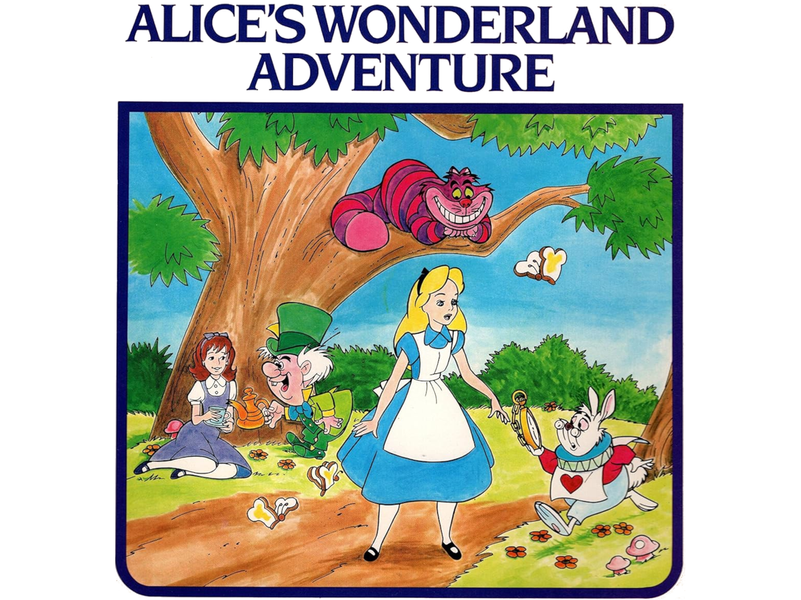

# Alice's Wonderland Adventure

The classic choose-your-own-adventure book, [*Alice's Wonderland Adventure*](https://videbouteilleprimaryschool.weebly.com/uploads/2/5/0/8/25089718/alices_wonderland_adventure.pdf), adapted to [Yarnspin](https://github.com/mattiasgustavsson/yarnspin).



Try it in your browser here:
https://robloach.github.io/yarnspin-alice/

## Running

```
yarnspin
```

## Building

```
yarnspin -p index.html
```

## Contributions

This is an experiment with how far we can go with adopting Alice's Wonderland Adventure into Yarnspin. If you find there is more we can add, feel free to. Some ideas:

- More music
- Sound effects
- Improved dialogs

## Credit

- Story by Jim Razzi
- Adapted to Yarnspin by [Rob Loach](https://robloach.net)
- [Forest Music](https://opengameart.org/content/forest) by [syncopika](https://opengameart.org/users/syncopika) under [CC4.0](https://creativecommons.org/licenses/by/4.0/deed.en)
- [GPL3](LICENSE.txt)
